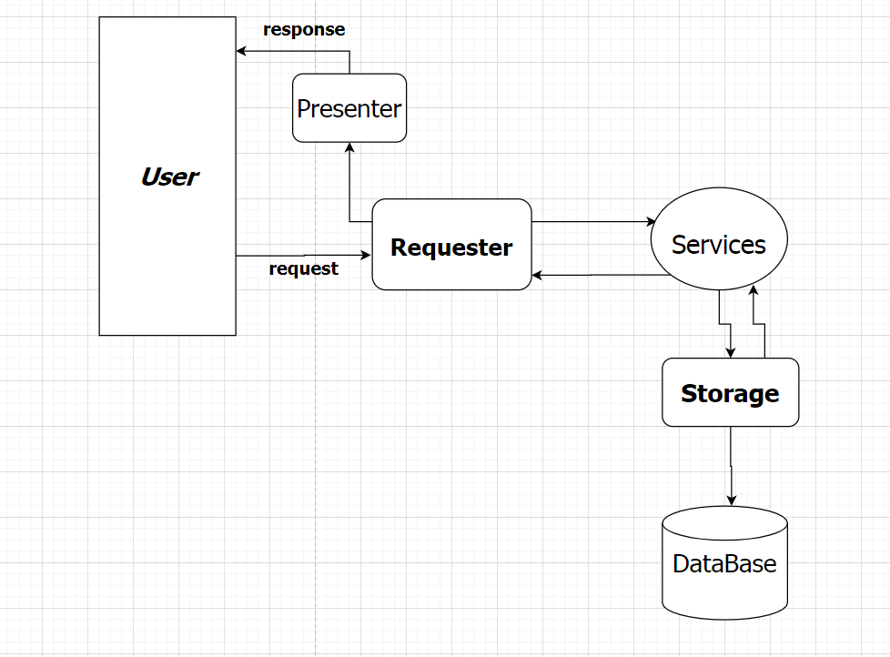
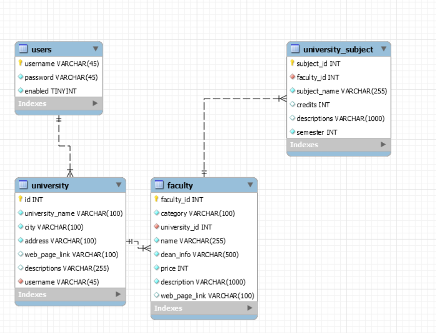

# **UniSearchEngine**

## General
### UniSearchEngine is web platform written in Java, using Spring Framework as core of the platform, where:
 - _a basic user can see/search/filter all the detailed informations about all the high schools/universities and faculties in them._
 - _On the other hand registered user/university admin. can register to add/modify new Universities which will be listed on platform._

# Credits:
### _"UniSearchEngine"_  was designed by students of Free University Of Tbilisi, as a project of OOP subject :
- Khatia Ivanova
- Basil Iakobashvili
- Archil Sharashenidze
- Nikoloz Sakandelidze; 

# Technologies used :
- Java
- Srping core, Srping MVC, Spring AOP
- JSP
- Javascript ( Vanilla )
- MySQL
- JDBC(Soon will be rewritten on Hibernate)

### _comment_
    "Spring Boot wasn't used in this project so that team members could learn Spring configurations from the scratch"
         
# **Project architecture**

# **Project Database Design**
### Used Database: _"MySQL"_

